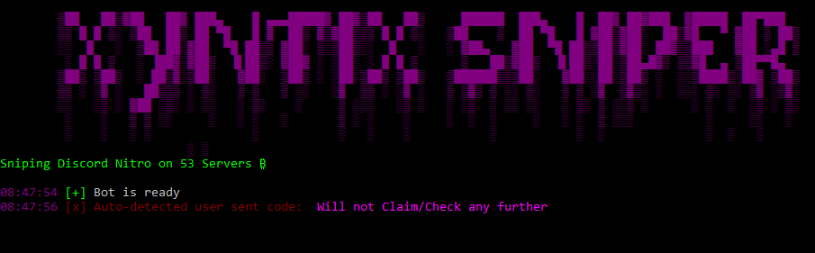

# NitroSniperGo

[](https://github.com/Vedzaa/NitroSniperGo/releases)

Xyntix sniper is a fork of Vedzaa's Discord Nitro sniper
to implement caching to reduce risk of continuously claiming
previous nitro codes/fake codes thus reducing ban risk

auto detects if user sent the gift code and then doesnt
continue further with the code claiming to reduce ban
risk even more


these two features slow it down
a little bit but reduce the risk
of you losing your account.




### Usage

```
 go get github.com/bwmarrin/discordgo
 go get github.com/fatih/color
 go get github.com/valyala/fasthttp
 go get github.com/patrickmn/go-cache
 go build
 ./XyntixSniperGo
 ```
 
### How to obtain your token
https://github.com/Tyrrrz/DiscordChatExporter/wiki/Obtaining-Token-and-Channel-IDs#how-to-get-a-user-token

### Disclaimer
This can get your account banned if you run multiple instance at the same time and/or claim too much Nitros in a too short amount of time. Use it at your own risks.
